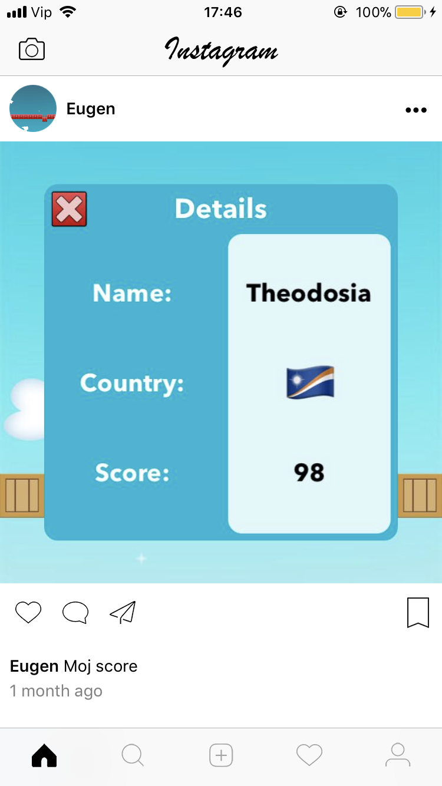

# TrainingFirebase

Instagram app based on Firebase v4 (read/write).

#

Registration/SignUp screens:
- imagePicker
- handled with Firebase registration, mail checking etc

   
 
#

Home screen:
- fetching posted feeds from your self and followed one via Firebase
- every feed got some functionalitys, like and comment on feed implemented

  
 
#

Comments screen:
- see all comments on specific feed

  
 
#

Search screen:
- search trougt base of registrated users on Firebase
- available to follow/unfollow users
  
 
#

Images/Share screens:
- loads images from device (lower resolution)
- top cell is shown in greater resolution then others
- picked image goes into shering like new feed

   
 
 #
 
 Profile sceen:
 - fetch user details
 - loads all your images
   
  
#

Core Features:
- swift 4
- autoLayout with code, no Storyboards
- login and Registration on Firebase
- custom TabBar
- imagePicker, save on Firebase
- home feed
- user search and follow
- custom segue to camera
- post comments
- pagination
- push notification

